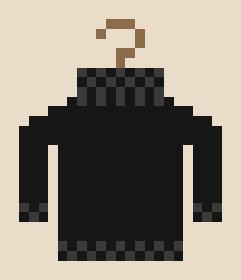

<p align="center">
  
</p>
<p align="center">
  <a href="https://skills.sh/danielmarbach/turtleneck"></a>
  <br>
  <a href="https://danielmarbach.github.io/turtleneck/">danielmarbach.github.io/turtleneck</a>
</p>

# Turtleneck

Makes your AI agent think like the architect everyone rolls their eyes at,
until they're right.

[Ponytail](https://github.com/DietrichGebert/ponytail) makes the agent write less code. Turtleneck makes it stop before
the decisions that ponytail tells you not to make lightly: where the
boundary goes, what the system is coupled to, which future you are closing
off, and who pays in year three.

It is a protocol rather than a persona: the model imitates nobody and skips
no steps.

## How it works

Before recommending, the agent checks whether the decision is architecture
at all: hard to undo, closes off futures, crosses a team boundary, or costs
someone else money to run. If not, it says so in one line and moves on.

If it is, the agent climbs six rungs:

```
1. Ride the elevator       → penthouse (outcome, who pays) AND engine room
                             (what changes, what on-call sees). Missing a floor? Ask.
2. Open the solution space → ≥3 options that differ in kind, plus defer, plus buy.
                             The option you arrived with gets attacked hardest.
3. Stress it               → 8-12 stressors, two of them absurd, no probabilities.
                             Stressors that break the same parts reveal hidden coupling.
4. Price the options       → build, run and who pays, undo, what stays open.
                             Surviving a stressor is a purchase. Name the price.
5. Cross-examine           → elevator pass: which stressors are worth paying for?
                             residuality pass: which price assumes a known future?
6. Decide or defer         → "we give up X to get Y", flip conditions,
                             and the decisions only the owner can make.
```

The output is a one-page decision record: every option that lost and why,
every stressor and what it broke, the accepted trade-off stated as a loss
and a gain, the facts that would flip it, and the questions the model could
not answer because they need domain knowledge it does not have.

That last section matters most, because the failure mode of AI in
architecture is plausible design in a domain nobody in the room understands.
Turtleneck turns every gap in knowledge into a question.

## Banned moves

The things a model does when it is pattern-matching instead of deciding:

- "It depends" without saying on what.
- Trade-off tables rating scalability, maintainability, performance as
  high/medium/low.
- A pattern named without the stressor it answers.
- "Best practice" as a rationale.
- New technology as the fix, without naming the habit it would punish.
- Three options listed, one explored.
- Quoting named architects. Argue, don't cite.

Full list with the better move next to each:
[skills/turtleneck/references/cliches.md](skills/turtleneck/references/cliches.md).

## Commands

| Command | What it does |
|---------|--------------|
| `/turtleneck [napkin \| full \| deep]` | Run the protocol. Without a level, the gate picks one from undo cost. |
| `/turtleneck-review` | Gap list over an existing ADR, design doc, RFC, or PR description. |
| `/turtleneck-stress` | Residuality pass alone: stressors, residues, attractors, boundary candidates. |
| `/turtleneck-help` | Quick reference. |

Levels track how expensive the decision is to undo. `napkin` is ten lines
for a first cut. `full` is the protocol. `deep` adds the
stressor-by-component incidence matrix and contagion trace, for boundaries
several teams will live behind. When you name no level, the gate picks
napkin for cheap-ish undos and full for expensive ones, and says why. Deep
only runs when asked.

## Install

**Any agent, via the skills CLI**

```
npx skills add danielmarbach/turtleneck
```

Installs the four skills into whichever supported agents it detects. Add
`--skill turtleneck` to take only the main protocol.

**Claude Code**

```
/plugin marketplace add danielmarbach/turtleneck
/plugin install turtleneck@turtleneck
```

**Codex**

```
codex plugin marketplace add danielmarbach/turtleneck
codex plugin add turtleneck@turtleneck
```

Skills are invoked with `@`: `@turtleneck`, `@turtleneck-review`,
`@turtleneck-stress`.

**pi**

```
pi install git:github.com/danielmarbach/turtleneck
```

**Any host that reads `AGENTS.md`**

Copy `AGENTS.md` into your project root or `~/.config/<host>/AGENTS.md`. The
always-on ruleset works without the commands.

All adapters point at the same `skills/` folder, with no hooks and no
extension code.

## The two lenses

The protocol pairs two bodies of work that pull in different directions.

**The Architect Elevator** (Gregor Hohpe). Architects ride between the
penthouse where business decisions happen and the engine room where systems
run. A decision described on one floor is not a decision. Architecture is
selling options, and options have a premium. Loose coupling has a price on
both sides. New technology punishes bad habits. The deliverable is the
trade-offs, made explicit.

**Residuality Theory** (Barry O'Reilly). The business environment is not a
stable system with knowable probabilities. So instead of listing likely
risks, hit the naive design with random stressors, including absurd ones,
and let the component structure emerge from what survives. Two components
that break under the same stressor are coupled, whether or not the code
shows it.

They disagree in a useful way. The elevator says resilience is not free and
asks who upstairs cares about this stressor. Residuality says your tidy
price table assumes you know which future arrives. Rung 5 runs that
argument on every decision.

Neither author is involved in or endorses this project. Read their books.
This repo only holds the working questions.

- Gregor Hohpe: *The Software Architect Elevator*, *37 Things One Architect
  Knows About IT Transformation*, *Cloud Strategy*, *Platform Strategy*,
  *Enterprise Integration Patterns*. [architectelevator.com](https://architectelevator.com)
- Barry O'Reilly: *Residues: Time, Change, and Uncertainty in Software
  Architecture*, *The Architect's Paradox*. This is the Barry O'Reilly of
  Black Tulip Technology, not the author of *Unlearn*.
  [residuality.io](https://residuality.io)

## With ponytail

They compose. Turtleneck decides where the boundary goes.
[Ponytail](https://github.com/DietrichGebert/ponytail) decides
how little code goes inside it. Turtleneck's gate hands anything that is
not architecture straight back.

## The name

The black turtleneck is the uniform of the person who decides what not to
build. [darrenohd/turtleneck](https://github.com/darrenohd/turtleneck) got
there first with a ponytail sibling for product scoping, one level up from
code. This project is unrelated and landed on the same name independently.
If you want the product-management version, that is the place.

## Evals

`evals/` holds a stdlib-only harness that runs every case twice against a
local Ollama model, once with the skill in the system prompt and once
without, and scores both with the same deterministic checks: required
sections, option count, stressor count, absurd stressors, the trade-off
stated as a loss, flip conditions, owner questions, the gate on
non-architecture prompts, and the banned moves. An optional LLM judge
scores four rubric criteria.

```
python3 -m unittest discover -s evals -p "test_*.py"
python3 evals/run.py --arm both --concurrency 3 --judge
```

A second suite runs six of the Ford and Neward
[architectural katas](https://nealford.com/katas/list.html) and has a
stronger model score each record for architecture quality: did it pick the
load-bearing decision, use the brief, find a non-obvious coupling, price
against the stated team and scale, invent nothing. The latest mean is
46.8 out of 50. `./evals/regress.sh` reruns both steps after a skill change
and prints the mean next to the last committed scorecard.

Results land in `evals/results/`. See [evals/README.md](evals/README.md).

## Examples

Unedited records from the kata suite, with the judge's notes:

- [Make the Grade](examples/make-the-grade.md), a statewide testing system
  for 40,000 students.
- [Gird the Grid](examples/gird-the-grid.md), market software for small
  electric utilities with a four-nines requirement.

## Status

Draft. The eval measures protocol compliance. Whether the records are good
architecture still needs a human architect comparing them with what they
would have written.
